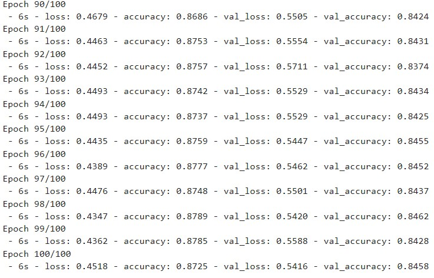

Scene Parsing also known as scene segmentation expects to segment an entire image in multiple objects which acts as crucial component in many higher level tasks such as scene understanding, Autonomous vehicles and satellite image analysis. A higher level understanding of the image is required if one wants to perform scene segmentation. The algorithm should not only understand the objects that are present but also the pixels that correspond to the object.
In this paper, we will how we used deep convolutional neural network to do image segmentation. We will discuss the whole pipeline – from preparing the data to building the model.
There were various steps discussed in the paper, but the approach used by us was a bit different and as such the results obtained by us were not similar to the ones obtained by the authors.

<h3>DATASET</h3> 

The Dataset on which we trained and tested the network was taken from the PASCAL Visual object classes challenge 2012 (VOC2012). The dataset contains a total of 11540 images of 20 different class labels. The 20 different classes are – ‘person’ , ‘bird’, ‘cat’, ‘dog’, ‘horse’, ‘sheep’, ‘aeroplane’, ‘bicycle’, ‘boat’, ‘bus’, ‘car’, ‘motorbike’, ‘train’, ‘bottle’, ‘chair’, ‘dining table’, ‘potted plant’, ‘sofa’ and ‘TV’.
Out of this large dataset, we selected a small subset of 367 images of 2007 only. This was done because of the computation limitation of our system. As this is not a classification task, the balance of the dataset was not a important parameter when selecting images and was not taken into consideration as it does not affect the performance of the Model.
A sample image of the dataset is shown if Fig. 1.

<h3>Pre-Processing</h3>
The Images that were in the in the dataset could not be used for the purpose of the segmentation as it is. Thus following pre-processing steps were done before passing into the model
<h5>Resize:</h5> We have resized all the images to the size of 224*224*3. The reason for selecting this particular size is because of its usage in VGG and FCN model. These values typically range from 224*224*3 to 512*512*3, with an aspect ratio of 1. The input height and width also helps in deciding the value of ‘Kernel size’ and ‘Strides’ to be used in the model

Figure 2 : image after resize
For the Segmentation Maps the PNG format is used as JPEG format is lossy and might result in the change in the value of pixel. The size of the input images and segmentation images are to kept similar.

<h3>Model Development</h3>
For the purpose of model development we have used Keras API to define our segmentation model with skip connection. We have made a segmentation model built upon a base CNN network. The standard model of VGG16 was selected for the base network. 
We appended a fully connected layer that enables the network to learn something using global information. Whereas the spatial information is stored by making all the layer of VGG16 to convolutional layers. In a way VGG can also be viewed as Fully Convolutional Network(FCN). 
Thus the model is Similar to VGG but the final classifier layer has been discarded and has been converted to all fully connected layer to convolutions. The model summary of our model is given in fig. 3. The figure shows the various layer used along with the trainable parameter and non trainable parameters. 
A brief of various layers used and their purpose is also explained

Conv2d is a 2 dimensional convolutional layer. We have used 32 filters of size 3*3 in this layer. It takes an input of 32*32*3 size image and gives a feature map as an output.
MaxPooling layer is used to reduce the dimension of the feature. This is done without losing any important information from the feature map.
Conv2Dtranspose simply reverses the forward and backward passes of convolution cda
For the squashing function, I have used ReLu and softmax.	

<h3>Hyperparameters</h3>
Epochs : 100
Learning Rate: 1e-2
Momentum: 0.9
Optimizer: Stochastic Gradient Descent
The prediction Accuracy(discussed below) of the model was good with the hyperparameters used. Change in learning rate or any other parameter did not improve the performance of the model in any significant manner. Thus the parameter were not subject to adjustment and are not discussed in detail

<h3>Training and Testing</h3>
After Making and compiling the model, we started training the model. Fig.4 shows the training of the model. 

After the model has been trained, we executed it on the training set, to measure its accuracy. As we can, the model that we trained has an accuracy of 85 % . 

The graph in Fig. 5 shows the cost of train vs test, that we obtained while training and testing the model.

As can be seen from the graph, the cost decreased with the increase in epochs.
We calculated Intersection over union for this model and we got a mean IOU of 0.397
The graph in fig.6 shows the Accuracy of Train vs Test data. As can be seen from fig. 6, the accuracy of model increases steadily with the increase in Epochs

After this we visualized the result we obtained. Fig.7 shows the result that we obtained for various images

<h4> Contributor </h4> 

I did this whole project along with <a url = "https://github.com/abhinavclemson" > Abhinav Singh </a>  
